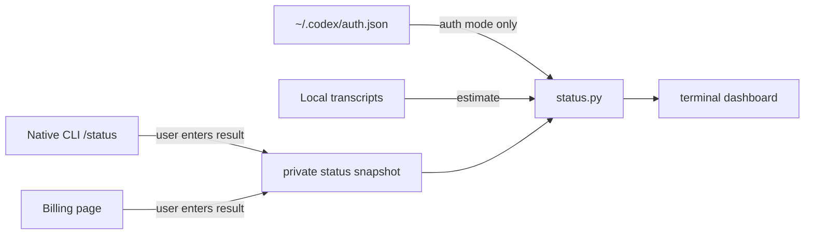

# Three-Pool Status Design

## Goal

Extend Codex Cost Tracker with a compact, on-demand terminal status view that
keeps the ChatGPT/Codex plan allowance, API data-sharing incentive, purchased
API credit/costs, and local token-price estimates separate.

## Scope

The command is read-only. It must never switch authentication, change data
sharing, create a background process, or persist an API key. Python 3.9+ and
the standard library remain the only runtime dependencies.

## Sources and provenance

| Pool | Source | Displayed status |
| --- | --- | --- |
| ChatGPT/Codex monthly allowance | The native Codex CLI `/status` result, supplied by the user as a snapshot | `user-confirmed native CLI snapshot`; percentage and observed time |
| API daily data-sharing incentive | OpenAI Usage API data grouped by service tier | `authoritative API`; eligible incentive input/output tokens and the UTC daily quota when configured |
| Paid API activity | OpenAI Costs API | `authoritative API`; costs for the requested UTC interval |
| Purchased API credit balance | OpenAI Billing page | `user-confirmed billing snapshot`; amount and observed time |
| Per-task token value | Local Codex transcripts | `local estimate`; never a balance or actual charge |

The monthly allowance has no documented personal-account API and is not cached
in this installation's local Codex state databases. The tracker therefore must
not read ChatGPT login tokens, reverse-engineer the CLI's private service, or
pretend that a snapshot is live. It should identify the active local auth mode
without exposing credentials, so the status view can explain which pool a new
task is able to consume.

## Command design

`python3 scripts/status.py` renders a compact terminal dashboard. It accepts a
JSON status file with `--state PATH`, defaulting to an XDG-style user state path
outside the repository. It shows the last observed value and source for each
pool. Missing values are printed as `unknown`, never as zero.

`python3 scripts/status.py snapshot-plan --remaining-percent 61 --reset-at
TIMESTAMP` stores the monthly-plan snapshot. `--observed-at` optionally records
the native CLI reading time; otherwise the command uses current UTC. Percentages
must be in the inclusive range 0–100 and timestamps must be ISO 8601 with an
offset. The state file must be created with mode 0600 and only contains totals,
timestamps, and provenance.

`python3 scripts/status.py snapshot-api-credit --usd AMOUNT` stores a billing
page balance separately. It refuses negative and non-finite values.

The first release does not make network calls. API Usage/Costs retrieval needs
a separate documented authentication and permissions design; it will be added
only after a read-only request is proven against the user's organization.

## Data flow

## Error handling

- A missing, unreadable, malformed, or permission-unsafe state file results in
  an `unknown` snapshot plus a clear warning; status rendering still works.
- Snapshot validation fails before writing anything, preserving the prior file.
- An auth file with an unknown mode reports `unknown`; no credential field or
  value is logged or returned.
- The terminal output labels the API daily incentive as unavailable until a
  future authoritative Usage API result has been imported.

## Validation

Tests must demonstrate snapshot round trips, validation failures that leave the
prior state untouched, 0600 state-file permissions, missing-value rendering,
and auth-mode redaction. Existing transcript-estimator tests must remain green.
`--help` must be exercised for every added script and command.
